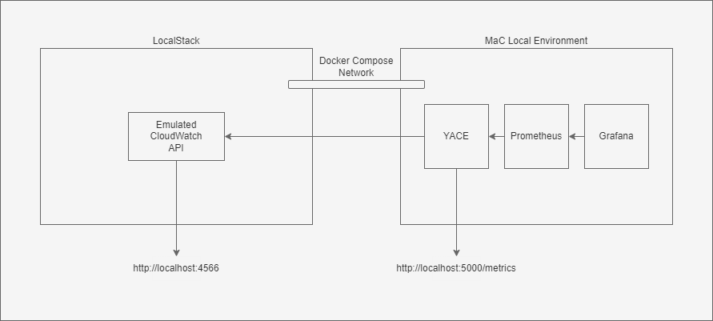

# LocalStack Integration with MaC Framework

[LocalStack](https://localstack.cloud/) can be used to simulate an AWS environment and Cloudwatch metrics telemetry to aid the development of the monitoring as code framework, without necessarily needing access to an actual AWS account.

This can be useful for offline development and testing of the MaC framework, especially for new team members who may not have access to an AWS account for testing purposes.

## Overview



## Prerequisites

You will need to have installed the following:

- [docker](https://docs.docker.com/engine/install/)
- [docker-compose](https://docs.docker.com/compose/install/)
- [awscli](https://docs.aws.amazon.com/cli/latest/userguide/getting-started-install.html)

## Getting Started

1. Run the MaC local development environment. This will implicitly create the local_default network, which the LocalStack docker-compose configuration will use.

   ```sh
   cd ../local/
   docker-compose up
   ```

1. Run LocalStack using the provided `docker-compose.yml` file.

   ```sh
   docker-compose up
   ```

1. The LocalStack service shares its network configuration with the MaC local development environment.

   This allows the YACE CloudWatch exporter, running within the MaC local development environment, to connect to LocalStack at http://localstack:4566.

1. The YACE configuration file has been set up to allow auto-discovery of metrics from an AWS account. When running against an actual AWS account, this is desireable and a useful default configuration.

   However, when working with LocalStack it does not appear to be possible to rely on this automatic discovery mechanism since metrics are produced manually using the AWS CLI, or related SDK, e.g. using [put-metric-data](https://docs.aws.amazon.com/cli/latest/reference/cloudwatch/put-metric-data.html).

   Fortunately, YACE also supports [static metric configuration](https://github.com/nerdswords/yet-another-cloudwatch-exporter#static-configuration) which allows additional metrics to be specified, without relying on discovery using resource tags.

   The AWS metrics that are currently supported by the MaC framework have been configured in the static configuration section to allow them to be used with LocalStack.

1. In order to point YACE at the LocalStack AWS emulator, you must add the following environment variables in the `yace` service section of the MaC local development envionrment `docker-compose.yml` file:

   ```yml
   environment:
     - AWS_ENDPOINT_URL=http://localstack:4566
     - AWS_REGION=eu-west-2
   ```

   Since YACE mounts the `~\.aws\credentials` file at runtime, you can authenticate against the LocalStack environment simply by running `aws configure` and specifying "test" for the ACCESS_KEY and SECRET_ACCESS_KEY values. Your resulting configuration file will look something like this:

   ```ini
   [default]
   aws_access_key_id = test
   aws_secret_access_key = test
   ```

1. Run the MaC local development environment ensuring that you have selected the `monitoring-fullstack` profile.

   ```sh
   docker-compose --profile monitoring-fullstack up
   ```

1. Supply metrics to the LocalStack CloudWatch API.

   You can interact directly with the LocalStack environment using the standard AWS CLI tools. Simply ensure that you have supplied the `--endpoint-url=http://localhost:4566` when running your commands.

   e.g.

   ```sh
   aws --endpoint-url="http://localhost:4566" sqs create-queue --queue-name sample-queue
   ```

   For convenience it might be desirable to alias the command

   ```sh
   alias awslocal="aws --endpoint-url=http://localhost:4566"
   ```

   Alternatively LocalStack provide an alernative `awslocal` command line tool which doesn't require supplying the endpoint URL on each command. See [the LocalStack Integration documentation](https://docs.localstack.cloud/integrations/aws-cli/#localstack-aws-cli-awslocal) for further details.

   ### Examples

   Here are some example commands that can be used to push simulated SQS metrics into LocalStack.

   ```sh
   awslocal cloudwatch put-metric-data --namespace "AWS/SQS" --metric-data '[{"MetricName": "ApproximateNumberOfMessagesVisible", "Value": 0}]'

   awslocal cloudwatch put-metric-data --namespace "AWS/SQS" --metric-data '[{"MetricName": "ApproximateAgeOfOldestMessage", "Value": 5}]'

   awslocal cloudwatch put-metric-data --namespace "AWS/SQS" --metric-data '[{"MetricName": "NumberOfMessagesSent", "Value": 10}]'

   awslocal cloudwatch put-metric-data --namespace "AWS/SQS" --metric-data '[{"MetricName": "NumberOfMessagesDeleted", "Value": 0}]'
   ```

   Metric dimensions can be passed in when calling `put-metric-data` which can be important when working with the MaC local development environment as MaC will search for metric dimensions to determine the purpose of cerain AWS metrics e.g. determining if an SQS queue is a standard queue or a dead-letter queue.

   It is important to ensure that any dimensions being passed into the put-metric-data command are also specified in the YACE static metric configuration since they do not seem to be detected automatically by the YACE auto-discovery feature.

   ```sh
   awslocal cloudwatch put-metric-data --namespace "AWS/SQS" --metric-data '[{"MetricName": "ApproximateNumberOfMessagesVisible", "Value": 0, "Dimensions": [{"Name": "QueueName", "Value": "standard-queue"}, { "Name": "queue_type", "Value": "standard"}]}]'

   awslocal cloudwatch put-metric-data --namespace "AWS/SQS" --metric-data '[{"MetricName": "ApproximateAgeOfOldestMessage", "Value": 5, "Dimensions": [{"Name": "QueueName", "Value": "standard-queue"}, { "Name": "queue_type", "Value": "standard"}]}]'

   awslocal cloudwatch put-metric-data --namespace "AWS/SQS" --metric-data '[{"MetricName": "NumberOfMessagesSent", "Value": 10, "Dimensions": [{"Name": "QueueName", "Value": "standard-queue"}, { "Name": "queue_type", "Value": "standard"}]}]'

   awslocal cloudwatch put-metric-data --namespace "AWS/SQS" --metric-data '[{"MetricName": "NumberOfMessagesDeleted", "Value": 0, "Dimensions": [{"Name": "QueueName", "Value": "standard-queue"}, { "Name": "queue_type", "Value": "standard"}]}]'
   ```

   Corresponding YACE static configuration (note that the values need to match the metric data being passed in):

   ```yaml
   dimensions:
     - name: QueueName
       value: standard-queue
     - name: queue_type
       value: standard
   ```

   Unfortunately, the only way to simulate messages coming from both standard and dead-letter queues at the moment is to amend the configuration, restart YACE and push metric data in with different dimension values. This may require some futher investigation to improve the developer experience.

   Metrics for other services can be simulated by changing the `--namespace` value, the `MetricName` and adjusting the `Value`.

1. Once the metrics have been pushed into LocalStack, they should appear on the YACE `/metrics` endpoint at `http://localhost:5000/metrics`.

1. The MaC local development environment has already configured Prometheus to use YACE as a target, and so the metrics should also become visible from within the Prometheus console and from within Grafana dashboards.

1. The `generic` mixin contains an SLI configuration for AWS SQS which can be useful for quickly testing the end-to-end flow of metrics from LocalStack to a Grafana Dashboard.

   This can be deployed and run using the command:

   ```sh
   docker run --mount type=bind,source="$PWD"/output,target=/output --mount type=bind,source="$PWD"/mixin-defs,target=/input -it sre-monitoring-as-code:latest -m generic -rd -i input -o output
   ```

   It may be necessary to restart the local development environment after adding any new SLI configuration or rules.

## Limitations

At present, it does not appear to be possible to use YACE automatic discovery of LocalStack metrics using resource tags. Pushing metrics into LocalStack is very much a manual process for now, but may be made easier in the future via scripting or additional tooling.
